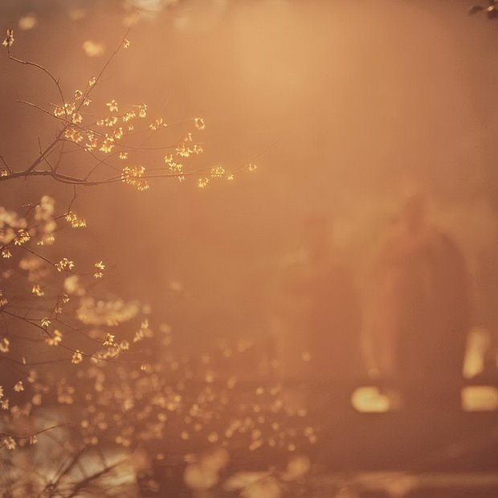
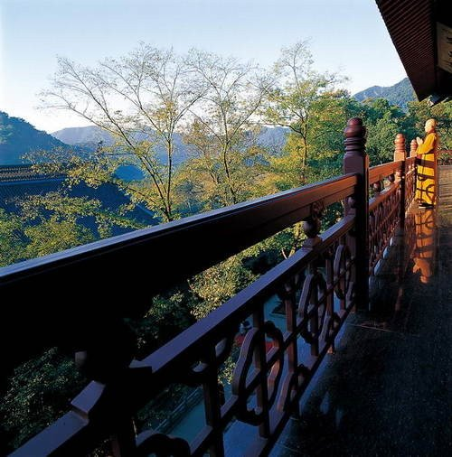

# 寻找心灵深处的菩提树

## 1、寻佛
**佛曰：人生有八苦：生，老，病，死，爱别离，怨长久，求不得，放不下。**

## 2、觉者
**佛曰：命由己造，相由心生，世间万物皆是化相，心不动，万物皆不动，心不变，万物皆不变。**

## 3、佛国
**佛曰：一花一世界，一草一天堂，一叶一如来，一砂一极乐，一方一净土，一笑一尘缘，一念一清净。心若无物就可以一花一世界，一草一天堂。**

## 4、禅静
**佛曰：一念愚即般若绝，一念智即般若生。**

## 5、凡圣
**佛曰：笑着面对，不去埋怨。悠然，随心，随性，随缘。注定让一生改变的，只在百年后，那一朵花开的时间。**

## 6、澄境
**佛曰：一切皆为虚幻**

## 7、梵净
**佛曰：坐亦禅，行亦禅，一花一世界，一叶一如来，春来花自青，秋至叶飘零，无穷般若心自在，语默动静体自然。**

## 8、梵音
**佛曰：一切有为法，如梦幻泡影，如露亦如电，应作如是观**

## 9、乐园
**佛曰：由爱故生忧，由爱故生怖，若离于爱者，无忧亦无怖**

## 10、净土
**佛曰：忘记并不等于从未存在，一切自在来源于选择，而不是刻意。不如放手，放下的越多，越觉得拥有的更多。**

## 11、礼佛
**佛曰：爱别离，怨憎会，撒手西归，全无是类。不过是满眼空花，一片虚幻。**

## 12、心尘
**佛曰：菩提本无树,明镜亦非台,本来无一物,何处惹尘埃。**

## 13、四季
**佛曰：缘来则去,缘聚则散,缘起则生,缘落则灭。**

## 14、沙门
**问佛：世间为何多苦恼？佛曰：只因不识自我。**

## 15、过客
**问佛∶世间为何有那麽多遗憾？ 
佛说∶这是一个婆娑世界，婆娑既遗憾， 没有遗憾，给你再多幸福也不会体会快乐。**

## 16、过堂
**问佛∶如何让人们的心不再感到孤单？ 佛说∶每一颗心生来就是孤单而残缺的，多数带著这种残缺度过一生， 只因与能使它圆满的另一半相遇时，不是疏忽错过就是已失去拥有它的资格。**

## 17、禅心
**春花秋月夏杜鹃，冬雪寂寂溢清寒**

## 18、静心
**佛曰。净心守志。可会至道。譬如磨镜。垢去明存。断欲无求。当得宿命。**

## 19、痛苦
**佛曰：人生在世如身处荆棘之中,心不动,人不妄动,不动则不伤;如心动则人妄动,伤其身痛其骨,于是体会到世间诸般痛苦!**

## 20、幻灭
**佛曰：从忘我到无我，那就是禅心的显现了**

## 21、错
**佛曰：不可说,不可说,一说即是错**

## 22、佛缘
**问佛：为何我的感情总是起起落落？佛说：一切自知，一切心知，月有盈缺，潮有涨落，浮浮沉沉方为太平。**

## 23、晨钟
**佛曰：吾法念无念念。行无行行。言无言言。修无修修。会者近尔。迷者远乎。言语道断。非物所拘。差之毫厘。失之须臾。**

## 24、梦幻泡影
**问佛：为何我的感情总是起起落落？佛说：一切自知，一切心知，月有盈缺，潮有涨落，浮浮沉沉方为太平。**

## 25、刹那
**佛曰：刹那便是永恒**

## 26、古寺月色
**参禅何须山水地，灭却心头火亦凉**

## 27、神游
**佛曰。净心守志。可会至道。譬如磨镜。垢去明存。断欲无求。当得宿命。**

## 28、早课
**佛曰：种如是因，收如是果，一切唯心造。**

## 29、授业
**佛曰：执著如渊，是渐入死亡的沿线 
佛曰：执著如尘，是徒劳的无功而返 
佛曰：执著如泪，是滴入心中的破碎，破碎而飞散 
佛曰：不要再求五百年，入我空门，早已超脱涅磐**

## 30、顿悟
**禅者心也，心中有禅，坐亦禅，立亦禅，行亦禅、睡亦禅，时时处处莫非禅也。禅也是顿生的，特定的时间，特定的空间，人顿悟，得禅意。**

## 31、超然
**空中，梧桐落叶飘零；眼前，萧瑟秋花凝霜。一位秀才问赵州禅师：“此情此景，如何感悟人生？”赵州禅师淡淡地说：“不雨花犹落，无风絮自飞。”**

## 32、岁月
**有人问大龙智洪禅师：“什么是微妙的禅？”
智洪禅师回答：“风送水声来枕畔，月移山影到窗前。”**

## 33、轮回
**自然界万物最灿烂之日，为何就是委地之时？**

## 34、天外
**问佛∶如果遇到了可以爱的人，却又怕不能把握怎麽办?
佛曰∶留人间多少爱，迎浮世千重变；和有情人，做快乐事，别问是劫是缘。**

## 35、妙谛
**青青翠竹无非般若，郁郁黄花皆是妙谛**

## 36、洗心
**与山水亲近,受自然洗礼,像梅水初放,似水滴轻贱;此情此境,以分不清那是山水那是人心,山水就是我,我就是山水;心底唇边微笑中发出愿望:"愿将山色供生佛,修到梅花伴醉翁"**

